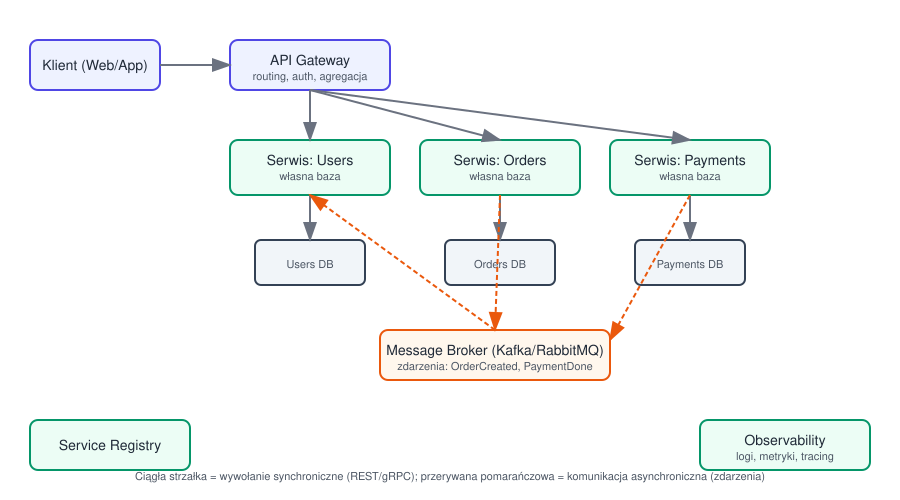

# Mikroserwisy

## 1. Monolit vs Mikroserwisy

**Monolit** – cała aplikacja to jeden deployowalny artefakt, jedna baza kodu, zwykle jedna baza danych.

- Plusy: prostota (na start), łatwiejsze transakcje, łatwiejszy lokalny development i debugging.
- Minusy: trudne skalowanie wybranych fragmentów, duży "blast radius" zmian, wolniejszy deployment przy dużych zespołach.

**Mikroserwisy** – system podzielony na małe, niezależnie deployowalne serwisy, każdy odpowiedzialny za jedną domenę biznesową (bounded context, patrz Domain-Driven Design).

- Plusy: niezależne skalowanie i deployowanie, izolacja awarii, zespoły mogą pracować niezależnie, dowolność technologii per serwis (polyglot).
- Minusy: złożoność operacyjna (sieć, monitoring, deployment), spójność danych między serwisami jest trudna, testowanie end-to-end jest trudniejsze, narzut na komunikację sieciową.

> Zasada: mikroserwisy to rozwiązanie problemu organizacyjnego/skalowania zespołu i systemu – nie zaczynaj od nich, jeśli nie masz jeszcze tego problemu ("monolith first").

## 2. Podział na serwisy

- Dziel wg granic biznesowych (**bounded context** z DDD), nie wg warstw technicznych.
- Każdy serwis powinien mieć **własną bazę danych** (database per service) – unika ukrytego sprzężenia przez wspólne tabele.
- Unikaj zbyt drobnego podziału ("nanoservices") – rośnie narzut komunikacji sieciowej i operacyjny.

## 3. Komunikacja między serwisami

### Synchroniczna

- **REST/HTTP** – proste, powszechne, ale każdy dodatkowy call to dodatkowe opóźnienie i punkt awarii.
- **gRPC** – szybszy (HTTP/2, protobuf), silne typowanie kontraktu, dobry do komunikacji wewnętrznej (service-to-service).

Ryzyko: łańcuch synchronicznych wywołań między serwisami tworzy zależności czasowe – awaria/wolność jednego serwisu spowalnia/wywala cały łańcuch.

### Asynchroniczna (event-driven)

- Serwisy komunikują się przez **broker zdarzeń** (Kafka, RabbitMQ, SQS/SNS) zamiast wołać się bezpośrednio.
- Wzorzec **publish/subscribe** – producent publikuje zdarzenie (np. `OrderCreated`), zainteresowane serwisy subskrybują.
- Zalety: luźne powiązanie (loose coupling), lepsza odporność na awarie, łatwiejsze skalowanie.
- Wady: trudniejsze debugowanie (przepływ nie jest liniowy), eventual consistency, potrzeba idempotencji konsumentów.

## 4. Kluczowe wzorce

### API Gateway

Pojedynczy punkt wejścia dla klientów zewnętrznych – routing do właściwego serwisu, agregacja odpowiedzi z kilku serwisów, autentykacja, rate limiting. Klient nie musi znać wewnętrznej topologii serwisów.

### Service Discovery

Serwisy w dynamicznym środowisku (np. Kubernetes, auto-scaling) zmieniają adresy IP. Service registry (np. Consul, Eureka, albo wbudowane DNS w K8s) pozwala znaleźć aktualny adres danego serwisu.

### Database per Service

Każdy serwis ma własną bazę – inne serwisy nie mają bezpośredniego dostępu do niej, tylko przez API/zdarzenia danego serwisu. Zapewnia niezależność, ale utrudnia zapytania łączące dane z wielu serwisów (rozwiązanie: CQRS / dedykowane widoki read-only, tzw. read models).

### Saga Pattern

Sposób na obsługę transakcji rozłożonych na wiele serwisów (bo nie ma tu klasycznego ACID transaction across services).

- **Choreography** – każdy serwis nasłuchuje zdarzeń i reaguje samodzielnie (brak centralnego koordynatora, prostsze, ale trudniej śledzić cały przepływ).
- **Orchestration** – centralny orkiestrator (saga coordinator) mówi każdemu serwisowi co ma zrobić i w jakiej kolejności (łatwiej śledzić stan, ale to dodatkowy komponent/punkt złożoności).
- Każdy krok ma zdefiniowaną **kompensację** (compensating transaction) na wypadek błędu – np. jeśli płatność się nie uda, cofamy rezerwację zamówienia.

### Circuit Breaker

Zapobiega kaskadowym awariom przy wołaniu innego serwisu.

- Stany: **Closed** (normalna praca) → po serii błędów **Open** (od razu zwraca błąd, nie woła dalej, daje czas na "ochłonięcie") → po czasie **Half-Open** (próbne zapytania, jeśli ok wraca do Closed).
- Biblioteki: Resilience4j, Polly, Hystrix (historycznie).

### CQRS (Command Query Responsibility Segregation)

Rozdzielenie modelu zapisu (commands) od modelu odczytu (queries) – często stosowane razem z event sourcing, żeby zbudować zoptymalizowane widoki odczytu łączące dane z wielu serwisów.

### Strangler Fig Pattern

Sposób migracji z monolitu do mikroserwisów – stopniowo "owijasz" i zastępujesz fragmenty monolitu nowymi serwisami, przekierowując ruch kawałek po kawałku, zamiast robić big-bang rewrite.

## 5. Odporność na awarie (resiliency)

- **Retry z backoff** (najlepiej z jitterem) – ponawianie nieudanych zapytań bez zalewania systemu.
- **Timeouts** – każde wywołanie sieciowe musi mieć limit czasu.
- **Bulkhead pattern** – izolacja puli zasobów (np. wątków/connection poola) per zależność, żeby awaria jednej integracji nie zjadła wszystkich zasobów.
- **Idempotencja** – operacje (szczególnie konsumenci zdarzeń) muszą być bezpieczne przy powtórnym wykonaniu (at-least-once delivery jest normą).

## 6. Observability (obserwowalność)

W systemie rozproszonym pojedyncze żądanie użytkownika może przechodzić przez wiele serwisów – kluczowe jest:

- **Logi** – scentralizowane (np. ELK/EFK stack), z korelacją przez `trace_id`/`correlation_id`.
- **Metryki** – (Prometheus + Grafana) – np. latency, error rate, throughput per serwis.
- **Distributed tracing** – (Jaeger, Zipkin, OpenTelemetry) – pokazuje pełną ścieżkę requestu przez serwisy z czasami każdego kroku.

## 7. Deployment i infrastruktura

- **Kontenery** (Docker) – pakują serwis z zależnościami w spójny, przenośny artefakt.
- **Orkiestracja** (Kubernetes) – zarządza deploymentem, skalowaniem (auto-scaling), self-healing (restart niedziałających podów), service discovery.
- **CI/CD per serwis** – każdy serwis ma własny pipeline, można go wdrażać niezależnie od innych.
- **Blue-green / canary deployment** – strategie bezpiecznego wdrażania nowych wersji bez przestoju i z możliwością szybkiego rollbacku.

## 8. Najczęstsze pułapki (pitfalls)

- Zbyt drobny podział serwisów bez realnej potrzeby (distributed monolith – masz złożoność mikroserwisów, ale wciąż silne sprzężenie).
- Współdzielona baza danych między serwisami (łamie izolację, tworzy ukryte zależności).
- Brak observability – w rozproszonym systemie bardzo trudno debugować "na czuja".
- Zbyt dużo synchronicznej komunikacji między serwisami (łańcuchy wywołań = kruchość + wysokie opóźnienia).
- Ignorowanie eventual consistency – klient/UI musi być zaprojektowany z myślą, że dane mogą się "dogonić" z opóźnieniem.

## 9. Pytania, które warto sobie zadać projektując mikroserwisy

1. Jakie są granice domenowe (bounded contexts)?
2. Jak serwisy będą się komunikować – sync czy async, i dlaczego?
3. Jak obsłużyć transakcję rozłożoną na kilka serwisów (Saga)?
4. Jak zapewnić odporność na awarię pojedynczego serwisu (circuit breaker, retry, fallback)?
5. Jak będziemy monitorować i debugować cały system (tracing, logi, metryki)?
6. Jak wygląda strategia deploymentu i rollbacku?
