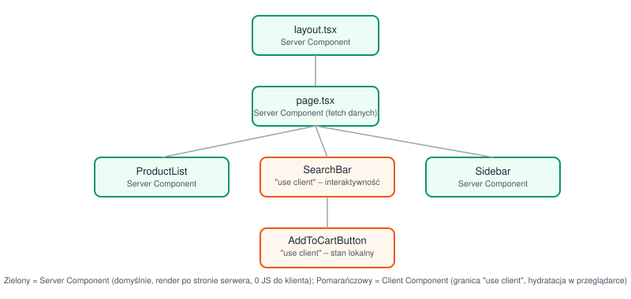
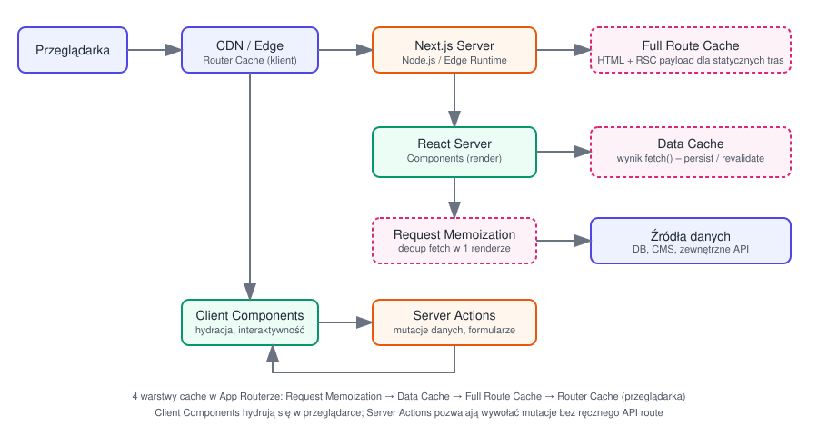
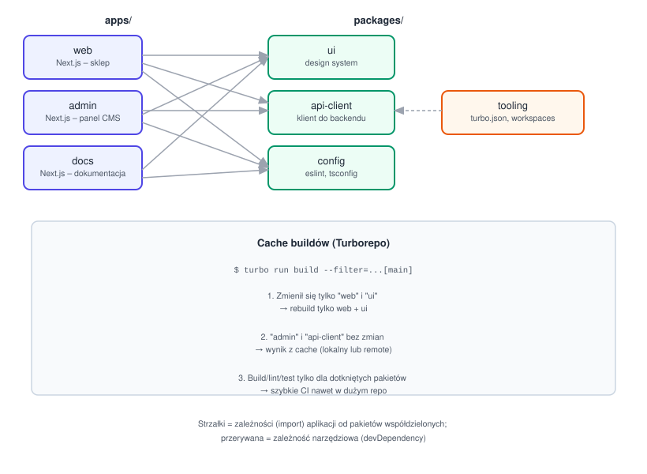

# Poprawna architektura aplikacji w Next.js

Notatki dotyczą App Routera (Next.js 13+), obecnego standardu.

## 1. Server Components vs Client Components

W App Routerze **domyślnie każdy komponent jest Server Component** – renderuje się wyłącznie na serwerze, nie wysyła swojego JS do przeglądarki.

- **Server Component** – może być `async`, czytać bezpośrednio z bazy/API, ma dostęp do sekretów (env vars), ale **nie może** używać hooków (`useState`, `useEffect`) ani zdarzeń (`onClick`).
- **Client Component** – oznaczony dyrektywą `"use client"` na górze pliku. Potrzebny wszędzie, gdzie jest interaktywność, hooki, API przeglądarki (localStorage, window) albo biblioteki zależne od stanu klienta.

**Zasada projektowa: "server-first, client at the leaves"** – trzymaj `"use client"` jak najniżej w drzewie komponentów (na "liściach" – przyciski, formularze, elementy z lokalnym stanem), a nie na górze layoutu. Dzięki temu duża część UI renderuje się na serwerze i nie obciąża bundla JS.



Częsty błąd: oznaczenie całej strony `"use client"` "na wszelki wypadek" – traci się wtedy większość korzyści RSC (streaming, mniejszy bundle, bezpośredni dostęp do danych).

## 2. Struktura katalogów (`app/`)

Konwencje plików specjalnych w App Routerze:

- `layout.tsx` – wspólny layout dla segmentu i jego dzieci, **nie re-renderuje się** przy nawigacji między podstronami (zachowuje stan, np. scroll).
- `page.tsx` – właściwa treść trasy.
- `loading.tsx` – automatyczny Suspense fallback podczas ładowania segmentu.
- `error.tsx` – Error Boundary dla segmentu (musi być Client Component).
- `not-found.tsx` – widok 404 dla segmentu.
- `route.ts` – Route Handler (odpowiednik API endpoint, np. `app/api/users/route.ts`).
- `template.tsx` – jak layout, ale re-montuje się przy każdej nawigacji (rzadziej używane).


### Organizacja projektu – dwa podejścia

1. **Colocation w** `app/` – komponenty, testy i style trzymane obok trasy, do której należą (np. `app/dashboard/_components/Chart.tsx`). Prefiks `_` wyłącza folder z routingu.
2. **Podział feature-based poza** `app/` – logika domenowa w `src/features/<feature>/` (komponenty, hooki, serwisy, typy), a `app/` zawiera tylko cienkie strony, które importują z `features`. Lepsze dla większych zespołów/aplikacji – oddziela routing od logiki biznesowej.

Rekomendacja dla średnich/dużych projektów:

```
src/
  app/                      # tylko routing: page.tsx, layout.tsx, route.ts
  features/
    products/
      components/
      hooks/
      api.ts                # funkcje fetch/mutacji dla tej domeny
      types.ts
  components/               # współdzielony, generyczny UI (design system)
  lib/                      # klienci (db, fetch wrapper), utils, config
```


## 3. Pobieranie danych (data fetching)

- Domyślnie pobieraj dane **w Server Components** przez `fetch()` lub bezpośrednie zapytanie do bazy/ORM – bez potrzeby dodatkowej warstwy API dla własnego frontendu.
- `fetch()` w Next.js ma wbudowane cachowanie i deduplikację (patrz sekcja o cache poniżej).
- Kolejne, niezależne fetch-e w różnych komponentach potomnych – rób równolegle (`Promise.all`), a jeśli dane nie są krytyczne od razu, opakuj komponent w `<Suspense>` i pozwól mu się streamować niezależnie od reszty strony.
- Route Handlers (`route.ts`) używaj wtedy, gdy dane mają konsumować **zewnętrzni klienci** (mobile app, webhook, publiczne API), a nie tylko własny frontend.


## 4. Warstwy cache w App Routerze

App Router ma 4 niezależne mechanizmy cache – zrozumienie ich to najczęstsze źródło "dlaczego moje dane się nie odświeżają":



1. **Request Memoization** – w obrębie jednego renderu (jednego requestu), identyczne wywołania `fetch()` są deduplikowane automatycznie.
2. **Data Cache** – wynik `fetch()` może być trwale cache'owany na serwerze między requestami. Kontrola: `fetch(url, { cache: 'force-cache' })` (domyślne), `{ next: { revalidate: 60 } }` (ISR – odśwież co 60s), `{ cache: 'no-store' }` (zawsze świeże dane).
3. **Full Route Cache** – Next.js może zapisać cały wyrenderowany HTML + payload RSC dla tras statycznych (bez dynamicznych danych per-request) i serwować je bez ponownego renderu.
4. **Router Cache (client-side)** – przeglądarka cache'uje payload odwiedzonych tras, żeby nawigacja `next/link` była natychmiastowa (back/forward, prefetch).


### Rewalidacja danych

- **Time-based (ISR)**: `revalidate: N` – dane odświeżają się co N sekund.
- **On-demand**: `revalidateTag()` / `revalidatePath()` – wywoływane np. w Server Action lub webhooku po zmianie danych (np. po edycji artykułu w CMS), żeby natychmiast unieważnić konkretny cache.

Praktyczna zasada: tagowanie fetchy (`fetch(url, { next: { tags: ['products'] } })`) i wołanie `revalidateTag('products')` po mutacji – to najbardziej przewidywalny sposób utrzymania świeżości danych bez rezygnacji z cache.

## 5. Mutacje danych – Server Actions

Server Actions (funkcje `"use server"`) pozwalają wykonać mutację (np. zapis formularza) bezpośrednio z komponentu, bez ręcznego tworzenia API route i fetch po stronie klienta.

- Działają zarówno z formularzy HTML (progresywne ulepszanie – działa nawet bez JS), jak i wywołane programowo z Client Component.
- Po mutacji zwykle wołasz `revalidatePath()`/`revalidateTag()`, żeby UI pokazał świeże dane.
- Traktuj je jak **granicę zaufania** – tak jak każdy endpoint API: waliduj input (np. Zod) i sprawdzaj autoryzację wewnątrz akcji, bo można je wywołać bezpośrednio (nie polegaj tylko na tym, że przycisk jest ukryty w UI).


## 6. Rendering strategies – kiedy co


| Strategia         | Kiedy używać                                                                       | Jak w App Routerze                                                               |
| ----------------- | ---------------------------------------------------------------------------------- | -------------------------------------------------------------------------------- |
| **Static (SSG)**  | treść rzadko się zmienia (blog, marketing)                                         | domyślne zachowanie, jeśli trasa nie używa dynamicznych API/danych `no-store`    |
| **ISR**           | treść zmienia się okresowo (katalog produktów)                                     | `revalidate: N` na fetchu lub segmencie                                          |
| **Dynamic (SSR)** | dane per-request (spersonalizowane, zależne od cookies/auth)                       | użycie `cookies()`, `headers()`, albo `cache: 'no-store'` wymusza dynamic render |
| **Streaming SSR** | strona ma wolne i szybkie fragmenty danych                                         | `<Suspense>` + async Server Components, `loading.tsx`                            |
| **CSR**           | dane czysto po stronie klienta, mocno interaktywne widoki (edytor, dashboard live) | Client Component + `useEffect`/SWR/React Query                                   |


## 7. Middleware

`middleware.ts` uruchamia się **przed** renderem trasy (na Edge Runtime) – typowe zastosowania:

- Przekierowania/rewrite na podstawie geolokalizacji, A/B testów, feature flag.
- Sprawdzenie sesji/auth przed wejściem na chronioną trasę (redirect do `/login`).
- Nagłówki bezpieczeństwa, i18n routing.

Middleware powinno być **lekkie** – działa na każdym matched requeście, unikaj tam ciężkich operacji (np. zapytań do bazy).

## 8. Runtime: Node.js vs Edge

- **Node.js runtime** (domyślny) – pełne API Node, dostęp do wszystkich bibliotek/ORM, dłuższy cold start.
- **Edge runtime** – uruchamia się bliżej użytkownika (niższe opóźnienie), ale ograniczone API (brak part Node core), krótszy limit czasu wykonania. Dobre do middleware, prostych Route Handlers, personalizacji.

Wybór deklarujesz per segment: `export const runtime = 'edge'`.

## 9. Bezpieczeństwo i separacja server/client

- Kod z sekretami (klucze API, connection stringi) trzymaj tylko w plikach bez `"use client"` – zmienne bez prefiksu `NEXT_PUBLIC_` nigdy nie trafiają do bundla klienckiego.
- Import pliku serwerowego (np. klienta bazy danych) w Client Component to częsty błąd – oznacz krytyczne moduły `import 'server-only'`, żeby build rzucił błąd przy takiej pomyłce.
- Waliduj dane wejściowe w Server Actions/Route Handlers tak samo rygorystycznie jak w klasycznym API – klient nie jest zaufaną granicą.


## 10. Organizacja większych aplikacji


### Monorepo (Turborepo/Nx)

Monorepo ma sens, gdy masz **więcej niż jedną aplikację** (np. sklep + panel admina + dokumentacja) współdzielącą design system, typy czy klienta API, albo gdy chcesz, żeby zmiana w jednym miejscu (np. w komponencie `Button`) była natychmiast widoczna we wszystkich aplikacjach bez publikowania osobnej paczki npm.



**Przykładowa struktura** (pnpm workspaces + Turborepo, ale ten sam układ działa z Nx czy Yarn workspaces):

```
my-monorepo/
├── apps/
│   ├── web/                 # Next.js – główna aplikacja (sklep)
│   │   ├── app/
│   │   ├── package.json     # zależy od "ui", "api-client", "config"
│   │   └── next.config.js
│   ├── admin/                # Next.js – panel administracyjny
│   │   └── app/
│   └── docs/                  # Next.js – dokumentacja / marketing
│       └── app/
├── packages/
│   ├── ui/                    # współdzielony design system (komponenty React)
│   │   ├── src/Button.tsx
│   │   └── package.json       # name: "@repo/ui"
│   ├── api-client/            # typowany klient do backendu (fetch/OpenAPI/tRPC)
│   │   └── src/index.ts
│   └── config/
│       ├── eslint-preset.js
│       └── tsconfig.base.json
├── package.json               # root – workspaces, skrypty "turbo run ..."
├── pnpm-workspace.yaml
└── turbo.json                 # definicja pipeline'u (build, lint, test, dev)
```

`package.json` w `apps/web` odwołuje się do pakietów lokalnych przez `workspace:*`:

```json
{
  "name": "web",
  "dependencies": {
    "@repo/ui": "workspace:*",
    "@repo/api-client": "workspace:*"
  }
}
```

`turbo.json` opisuje zależności między zadaniami – np. `build` aplikacji musi poczekać, aż zbudują się pakiety, od których zależy (`^build`):

```json
{
  "tasks": {
    "build": { "dependsOn": ["^build"], "outputs": [".next/**"] },
    "lint": {},
    "dev": { "cache": false, "persistent": true }
  }
}
```

**Kluczowa korzyść: cache i affected-only builds.** Turborepo/Nx trzymają graf zależności między pakietami i cache'ują wynik każdego zadania (build/lint/test) per pakiet. Jeśli w PR zmienił się tylko `packages/ui` i `apps/web`, komendy typu `turbo run build --filter=...[main]` przebudują **tylko** dotknięte pakiety, a resztę wezmą z cache (lokalnego albo remote cache współdzielonego przez cały zespół/CI) – patrz dolna część diagramu wyżej.

**Dobre praktyki przy monorepo z Next.js:**

- Każdy pakiet współdzielony ma **jasną odpowiedzialność** i własny `package.json` (nawet bez publikacji na npm) – to wymusza jawne zależności zamiast importów "na skróty" po ścieżkach względnych między aplikacjami.
- `packages/config` z jednym źródłem prawdy dla ESLint/TS/Tailwind – aplikacje rozszerzają wspólny config zamiast go duplikować.
- Nie twórz pakietu na wyrost dla jednego komponentu używanego w jednej aplikacji – wydzielaj do `packages/` dopiero, gdy coś faktycznie jest współdzielone przez ≥2 aplikacje.
- CI uruchamiaj przez `turbo run build lint test --filter=[origin/main]`, żeby testować tylko to, co faktycznie zmienił dany PR – w dużym repo to różnica między minutami a sekundami budowania.
- Uważaj na **granicę server/client w pakietach współdzielonych** – jeśli `@repo/ui` eksportuje komponent z hookiem, musi mieć `"use client"` u siebie, bo ta dyrektywa "podróżuje" razem z paczką do każdej aplikacji, która ją importuje.


### Podział wg domen

- **Podział wg domen biznesowych**, nie warstw technicznych (podobnie jak w mikroserwisach – bounded contexts) – ułatwia pracę wielu zespołów na jednym repo.
- **Warstwa dostępu do danych** (`lib/db.ts`, `features/*/api.ts`) oddzielona od komponentów – łatwiej testować i podmienić źródło danych.
- **Typy end-to-end** – współdzielone typy między Server Component (fetch) a Client Component (props) redukują rozjazdy kontraktu danych; przy własnym backendzie warto rozważyć generowanie typów z OpenAPI/GraphQL schema.


## 11. Częste błędy architektoniczne

- Oznaczanie całych stron `"use client"` zamiast lokalnie, na potrzebnych komponentach.
- Fetchowanie danych w `useEffect` w Client Component, gdy dane mogłyby być pobrane raz w Server Component (niepotrzebny round-trip, gorszy SEO, flash pustego stanu).
- Brak strategii rewalidacji – albo dane są wiecznie nieaktualne, albo `cache: 'no-store'` wszędzie "na wszelki wypadek", co zabija wydajność.
- Ciężka logika biznesowa w Route Handlers zamiast w wydzielonej warstwie serwisowej – utrudnia testowanie i reużycie (np. z Server Action).
- Brak walidacji/autoryzacji w Server Actions, bo "to nie jest publiczne API" – w praktyce jest wywoływalne z sieci tak samo jak endpoint.

