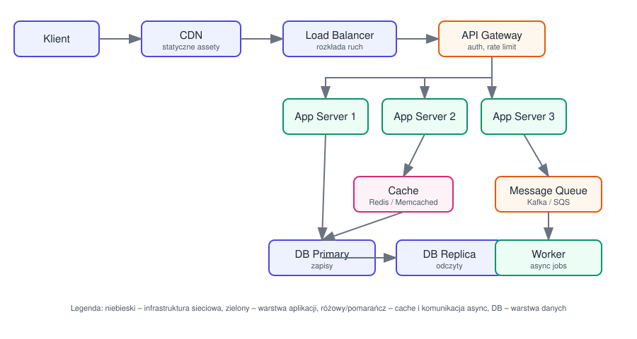
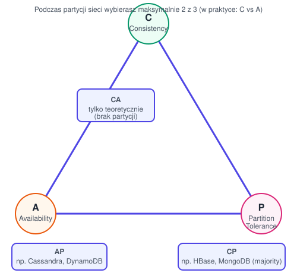

# System Design – podstawy

## 1. Czym jest system design?

Projektowanie architektury systemu tak, żeby spełniał wymagania **funkcjonalne** (co system ma robić) i **niefunkcjonalne** (jak dobrze ma to robić):

- **Skalowalność (scalability)** – system radzi sobie z rosnącym obciążeniem.
- **Dostępność (availability)** – system działa nawet przy awariach ("ile dziewiątek", np. 99,99%).
- **Niezawodność (reliability)** – system działa poprawnie i konsekwentnie.
- **Wydajność (latency/throughput)** – niskie opóźnienia, wysoka przepustowość.
- **Spójność (consistency)** – dane są takie same niezależnie od tego, z którego węzła są czytane.
- **Utrzymywalność (maintainability)** – łatwość rozwoju i debugowania.

Diagram poglądowy typowej architektury webowej:

## 2. Skalowanie

- **Vertical scaling (scale up)** – dokładamy zasoby do jednej maszyny (więcej CPU/RAM). Proste, ale ma limit fizyczny i jest single point of failure.
- **Horizontal scaling (scale out)** – dokładamy więcej maszyn/instancji. Wymaga load balancera i najczęściej bezstanowych (stateless) serwerów aplikacyjnych.

## 3. Load Balancing

Rozdziela ruch pomiędzy wiele instancji serwera.

- Algorytmy: Round Robin, Least Connections, IP Hash, Weighted.
- Warstwy: L4 (TCP/IP, szybki) vs L7 (HTTP, może routować po ścieżce/nagłówkach).
- Health checks – LB usuwa niezdrowe instancje z puli.

## 4. Cache

Cel: zmniejszyć obciążenie bazy danych i skrócić czas odpowiedzi.

- **Poziomy cache**: przeglądarka → CDN → cache aplikacji (Redis/Memcached) → cache bazy danych.
- **Strategie zapisu**:
  - *Cache-aside (lazy loading)* – aplikacja czyta z cache, przy miss czyta z DB i zapisuje do cache.
  - *Write-through* – zapis trafia jednocześnie do cache i DB (spójne, ale wolniejsze zapisy).
  - *Write-back (write-behind)* – zapis do cache, DB aktualizowana asynchronicznie (szybkie zapisy, ryzyko utraty danych).
- **Eviction policy**: LRU, LFU, TTL.
- **Cache invalidation** – jeden z klasycznie trudnych problemów w informatyce; trzeba dbać o spójność cache z danymi źródłowymi.

## 5. Bazy danych

### SQL vs NoSQL

| | SQL (relacyjne) | NoSQL |
|---|---|---|
| Schemat | sztywny, zdefiniowany | elastyczny/bezschematowy |
| Relacje | JOIN, ACID | zwykle denormalizacja |
| Skalowanie | głównie pionowe (choć są wyjątki, np. sharding) | głównie poziome |
| Przykłady | PostgreSQL, MySQL | MongoDB, Cassandra, DynamoDB, Redis |
| Kiedy używać | dane silnie powiązane, transakcje | duża skala, elastyczny model danych, wysoka dostępność |

### Replikacja

- **Primary-Replica (master-slave)** – zapisy do primary, odczyty można rozłożyć na repliki (odciążenie odczytów, ale replication lag → eventual consistency).
- **Multi-primary** – zapisy do wielu węzłów, trudniejsze utrzymanie spójności (konflikty zapisów).

### Partycjonowanie / Sharding

Dzielimy dane na fragmenty (shardy) rozłożone na różne serwery, np. po `user_id % N` albo range-based. Zwiększa skalowalność zapisów, ale utrudnia zapytania cross-shard i transakcje.

### Indeksy

Przyspieszają odczyt kosztem miejsca i wolniejszego zapisu (trzeba zaktualizować indeks przy każdym insert/update).

## 6. CAP Theorem

W obecności partycji sieciowej (P) system musi wybrać między spójnością (C) a dostępnością (A) – nie może mieć obu naraz.

- **CP** – priorytet spójności, część węzłów może odrzucać zapytania podczas partycji (np. HBase, MongoDB przy zapisach z większością).
- **AP** – priorytet dostępności, system odpowiada nawet niespójnymi danymi, które się później synchronizują (np. Cassandra, DynamoDB) – tzw. *eventual consistency*.

W praktyce większość systemów rozproszonych to kompromisy opisywane też przez **PACELC**: przy Partition wybieramy A/C, a w normalnej pracy (Else) wybieramy Latency/Consistency.

## 7. Message Queues / przetwarzanie asynchroniczne

- Rozprzęga (decouples) producentów i konsumentów zdarzeń/zadań.
- Przykłady: Kafka (log zdarzeń, wysoka przepustowość, replay), RabbitMQ/SQS (klasyczne kolejki, prostsze modele dostarczania).
- Wzorce dostarczania: at-most-once, at-least-once (najczęstsze – wymaga idempotentnych konsumentów), exactly-once (trudne i kosztowne).
- Use case: wysyłka maili, generowanie raportów, przetwarzanie zdarzeń w tle bez blokowania odpowiedzi API.

## 8. CDN (Content Delivery Network)

Sieć serwerów rozproszonych geograficznie, serwująca statyczne treści (obrazy, JS, CSS, wideo) bliżej użytkownika → mniejsze opóźnienia, mniejsze obciążenie serwera źródłowego.

## 9. Rate limiting

Ochrona API przed nadużyciem/przeciążeniem.

- Algorytmy: Token Bucket, Leaky Bucket, Fixed Window, Sliding Window.
- Implementacja zwykle na poziomie API Gateway lub reverse proxy.

## 10. API Gateway

Pojedynczy punkt wejścia do systemu: routing do serwisów, autentykacja/autoryzacja, rate limiting, agregacja odpowiedzi, terminacja TLS.

## 11. Jak podejść do zadania na rozmowie (system design interview)

1. **Doprecyzuj wymagania** – funkcjonalne (co system robi) i niefunkcjonalne (skala, dostępność, spójność, opóźnienia). Zapytaj o liczby (użytkownicy, QPS, wolumen danych).
2. **Oszacuj skalę** (back-of-the-envelope) – ile żądań/s, ile danych dziennie, jaki storage w czasie.
3. **Zaprojektuj wysoki poziom (high-level design)** – narysuj główne komponenty: klient, LB, serwery aplikacji, cache, DB, kolejki.
4. **Zejdź w szczegóły** kluczowych komponentów – model danych, API, wybór DB, strategia cache, obsługa awarii.
5. **Zidentyfikuj wąskie gardła i single points of failure** – zaproponuj rozwiązania (replikacja, sharding, cache, circuit breaker).
6. **Podsumuj trade-offy** – żadna decyzja nie jest "za darmo", pokaż że rozumiesz konsekwencje (np. eventual consistency vs strong consistency).

## 12. Typowe przykładowe zadania

- Projekt skracacza URL (URL shortener) – generowanie unikalnych kluczy, redirect, cache popularnych linków.
- Projekt systemu czatu – WebSockety, kolejność wiadomości, obecność (presence), skalowanie połączeń.
- Projekt news feedu – fan-out on write vs fan-out on read, ranking, cache.
- Projekt systemu rate limitera, systemu powiadomień, systemu do przechowywania plików (jak S3).
