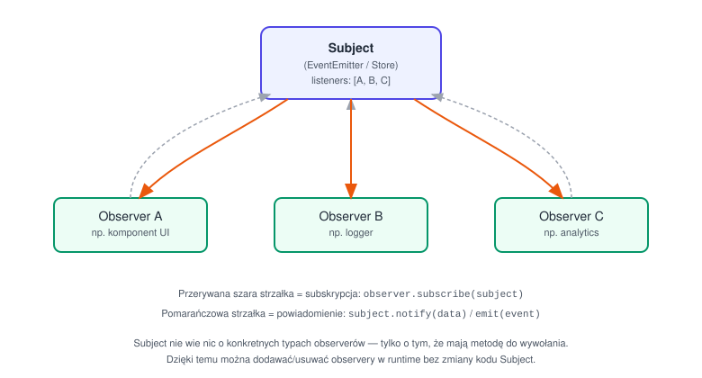
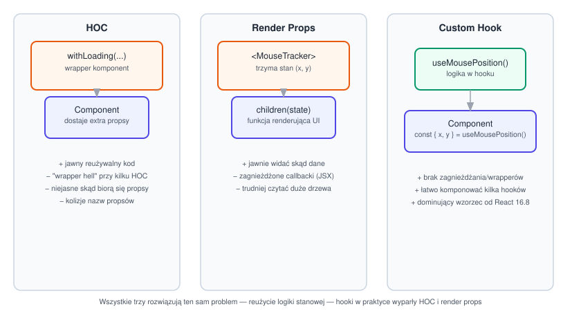
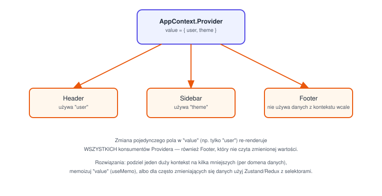

# Co pamiętać – proces rekrutacyjny Frontend

Notatka o typowym przebiegu rekrutacji na stanowisko frontendowe (test automatyczny + rozmowa techniczna) i o tym, jak się do niego przygotować.

## 🧱 Etap 1: Test automatyczny (największe sito)

Test odbywa się zazwyczaj na platformie typu CodeSubmit lub podobnej. Trwa od 60 do 90 minut. Środowisko nie ma zaawansowanego autouzupełniania, więc musisz znać składnię "z głowy".

### Czego się spodziewać?

- **Czysty JavaScript (ES6+)** – zadania algorytmiczne lub manipulacja danymi. Przykładowo: operacje na zagnieżdżonych obiektach/tablicach, asynchroniczność (Promises, async/await), obsługa błędów, debounce/throttle, czy implementacja własnych metod tablicowych (np. własny `.map()` lub `.reduce()`).
- **Zadanie z frameworka (React)** – zbudowanie prostego komponentu UI (np. wyszukiwarka z podpowiedziami live, interaktywna tabela z sortowaniem i filtrowaniem, prosty koszyk zakupowy).
- **CSS / HTML** – zazwyczaj musisz zadbać o to, aby stworzony komponent był responsywny (Flexbox/Grid) i estetyczny, nawet jeśli nie ma na to dużo czasu.

### Jak się przygotować?

- Poćwicz zadania typu Algorithm i Data Structure na LeetCode lub HackerRank (poziom Easy/Medium). Skup się na operacjach na tablicach (`map`, `filter`, `reduce`, `find`) – patrz [exercise_5](../exercise_5/) w tym repo.
- Powtórz podstawy asynchroniczności (jak działa Event Loop, jak poprawnie obsługiwać zapytania HTTP przez `fetch`) – patrz [frontend-interview-questions.md](./frontend-interview-questions.md).
- Napisz kilka prostych mini-aplikacji w czystym React bez używania zewnętrznych bibliotek (wszystko na wbudowanym stanie: `useState`, `useEffect`, `useMemo`).

## 🗣️ Etap 2: Rozmowa techniczna (Vetting Call)

Jeśli przejdziesz test, trafiasz na rozmowę live z frontendowym rekruterem technologicznym. Rozmowa jest w 100% po angielsku.

### Kluczowe zagadnienia teoretyczne, które MUSISZ znać

- **React pod maską** – jak działa Virtual DOM? Czym różni się komponent stanowy od bezstanowego? Kiedy komponent się renderuje ponownie i jak temu zapobiegać (`React.memo`, `useCallback`)?
- **Zarządzanie stanem** – kiedy użyć lokalnego stanu (`useState`), kiedy Context API, a kiedy Redux/Zustand?
- **TypeScript** – typowanie zaawansowane (Generics, Utility Types typu `Pick`, `Omit`, `Partial`), różnice między `interface` a `type`.
- **Wydajność (Performance)** – jak optymalizować aplikacje frontendowe? (lazy loading komponentów, optymalizacja obrazków, unikanie niepotrzebnych re-renderów).
- **Web API i przeglądarka** – różnice między `localStorage`, `sessionStorage` i cookies. Jak działa CORS? (patrz [frontend-interview-questions.md](./frontend-interview-questions.md) – sekcja o CORS).

### Zadanie Live Coding na rozmowie

Często polega na refaktoryzacji brzydkiego kodu (code review na żywo). Rekruter pokazuje komponent pełen błędów wydajnościowych, złych praktyk anty-Reactowych lub luk w bezpieczeństwie, a Twoim zadaniem jest wskazać błędy i przepisać go poprawnie.

## 💡 Praktyczne wskazówki, jak zdać

- **Mów na głos (think aloud)** – podczas live codingu rekruter nie ocenia tylko tego, czy kod działa, ale jak myślisz. Opowiadaj, dlaczego wybierasz takie, a nie inne rozwiązanie.
- **Dbaj o czysty kod** – nawet pod presją czasu w teście automatycznym nazywaj zmienne z sensem (`userId` zamiast `x`), unikaj pisania "kobył" (jedna funkcja robiąca wszystko) i pamiętaj o obsłudze błędów (np. `catch` przy zapytaniach API).
- **Przygotuj angielski "biznesowy"** – przed rozmową poćwicz opowiadanie o swoich poprzednich projektach frontendowych po angielsku. Skup się na tym, jaki problem rozwiązałeś i jaki to miało wpływ na biznes (np. "zoptymalizowałem ładowanie strony o 30%, co przełożyło się na mniejszy bounce rate").

## 🧠 Przykładowe pytania-pułapki

### 1. Jak dokładnie działa `useState` w kontekście asynchroniczności i kolejkowania (batching)?

Co konsola wypisze w poniższym przykładzie w React 18+?

```jsx
const [count, setCount] = useState(0);

const handleClick = () => {
  setCount(count + 1);
  setCount(count + 1);
  setCount(prev => prev + 1);

  console.log(count);
};
```

**Odpowiedź:** konsola wypisze `0`, a ostateczny stan po zakończeniu funkcji wyniesie `2`.

**Dlaczego w konsoli jest `0`?**
Aktualizacja stanu w React jest asynchroniczna z perspektywy wykonywanej funkcji. `setCount` nie zmienia zmiennej `count` natychmiast – nowa wartość będzie dostępna dopiero w kolejnym renderze komponentu. `console.log(count)` wciąż odwołuje się do `count` z domknięcia (closure) bieżącego renderu, czyli `0`.

**Dlaczego ostateczny stan to `2`, a nie `3`?**
- Pierwsze `setCount(count + 1)` bazuje na aktualnym closure, gdzie `count` wynosi `0`. Planuje zmianę na `0 + 1 = 1`.
- Drugie `setCount(count + 1)` również widzi `count` jako `0` (render się jeszcze nie odbył) – nadpisuje poprzedni plan i znowu planuje ustawienie stanu na `0 + 1 = 1`.
- Trzecie wywołanie używa tzw. **functional updater** (`prev => prev + 1`). Pobiera ono najbardziej aktualną wartość z kolejki aktualizacji (czyli zaplanowane `1`) i zwiększa ją o jeden (`1 + 1 = 2`).

**Automatic Batching:** React 18 łączy wszystkie te trzy wywołania w jeden re-render (dla oszczędności wydajności) — stąd tylko jedno przeliczenie stanu, a nie trzy osobne rendery.

**Wniosek/zasada do zapamiętania:** jeśli nowa wartość stanu zależy od poprzedniej, zawsze używaj functional updatera (`setCount(prev => prev + 1)`) zamiast odwoływać się do zmiennej ze closure (`setCount(count + 1)`) — inaczej wielokrotne wywołania w tym samym handlerze nadpisują się nawzajem zamiast się sumować.

### 2. Czym różni się `useMemo` od `React.memo`? Kiedy ich użycie może przynieść odwrotny skutek i POGORSZYĆ wydajność aplikacji?

**Różnica:**
- `useMemo` – hook służący do memoizacji **wartości** lub wyniku obliczeń wewnątrz komponentu (zapobiega ponownemu uruchamianiu ciężkich funkcji przy każdym renderze).
- `React.memo` – komponent wyższego rzędu (HOC), który memoizuje **cały komponent UI**. Zapobiega jego ponownemu renderowaniu, jeśli jego propsy nie uległy zmianie.

**Kiedy pogarszają wydajność?**
Memoizacja nie jest darmowa. Każde użycie `useMemo` lub `React.memo` zmusza procesor do wykonywania dodatkowych operacji (porównywanie tablicy zależności albo płytkie porównanie propsów – shallow comparison).

- Jeśli owiniemy w `React.memo` komponent, który i tak niemal zawsze dostaje nowe propsy (lub często się zmienia), aplikacja będzie działać wolniej, bo React za każdym razem wykona test porównawczy, który i tak zakończy się renderem.
- Używanie `useMemo` dla prostych operacji (np. filtrowanie małej tablicy z 5 elementami) kosztuje więcej procesora na zarządzanie hookiem niż na samo wykonanie tej operacji.

**Wniosek/zasada do zapamiętania:** memoizacja to optymalizacja dla konkretnego, zmierzonego problemu (drogie obliczenie, komponent renderujący się rzadko w stosunku do rodzica), a nie domyślna praktyka stosowana "na wszelki wypadek" wszędzie.

### 3. Dlaczego używanie indeksu tablicy (`key={index}`) jako klucza w React jest antywzorcem i jakie błędy w UI może to spowodować?

Wyobraź sobie komponent renderujący listę elementów pobieranych z API.

**Wyjaśnienie:**
React używa właściwości `key`, aby podczas procesu uzgadniania (reconciliation) zorientować się, które elementy na liście zmieniły pozycję, zostały dodane, lub usunięte.

**Problem:** indeks jest powiązany z **pozycją** w tablicy, a nie z konkretną treścią/tożsamością elementu.

**Konsekwencje w UI:**
- Jeśli zaimplementujesz filtrowanie, sortowanie lub usuwanie elementów z wnętrza listy, indeksy się przesuną. React pomyśli, że element pod indeksem `0` to wciąż ten sam komponent co wcześniej, tylko zmieniły mu się właściwości.
- Jeśli elementy listy zawierają wewnętrzny stan (np. niezapisany tekst w polu `<input>`, zaznaczony checkbox albo lokalny timer), ten stan **pozostanie na starej pozycji w UI**, mimo że dane wokół niego się zmieniły. Użytkownik zobaczy np., że usunął pierwszy produkt z koszyka, ale pole tekstowe z komentarzem do tego produktu przeskoczyło na produkt, który wskoczył na jego miejsce.

**Wniosek/zasada do zapamiętania:** jako `key` używaj stabilnego, unikalnego identyfikatora niezależnego od pozycji (np. `id` z bazy danych), a nie indeksu tablicy. Indeks jako `key` jest akceptowalny tylko wtedy, gdy lista jest statyczna i nigdy nie jest reorderowana/filtrowana/mutowana.

## 🏗️ Wzorce projektowe (Design Patterns)

Rekruterzy pytają o wzorce projektowe zwykle w dwóch kontekstach: klasyczne wzorce z GoF (Gang of Four) przełożone na JS, oraz wzorce charakterystyczne dla samego Reacta. Warto umieć nie tylko nazwać wzorzec, ale też podać *kiedy go użyć* i *jaki problem rozwiązuje* — to jest właściwa odpowiedź na rozmowie, nie sama definicja.

### Klasyczne wzorce (GoF) w JS

**Singleton** – gwarantuje, że dana klasa/moduł ma tylko jedną instancję w całej aplikacji, do której wszyscy sięgają po to samo, współdzielone miejsce. W JS zwykle "za darmo" dzięki systemowi modułów (ES modules są cache'owane po pierwszym imporcie — każdy kolejny `import` dostaje tę samą instancję, nie tworzy nowej).
```js
// config.js — moduł jest instancjonowany raz i współdzielony przy każdym imporcie
class Config {
  #settings = {};
  set(key, value) { this.#settings[key] = value; }
  get(key) { return this.#settings[key]; }
}
export const config = new Config();
```
Użycie: globalna konfiguracja, połączenie z bazą, cache, klient API współdzielony przez całą aplikację.

Kiedy NIE używać: w testach singleton bywa problematyczny — stan "przecieka" między testami, bo wszystkie odwołują się do tej samej instancji (jeden test może ustawić coś, co wpłynie na kolejny). Jeśli coś ma zależność testowaną w izolacji, lepiej wstrzykiwać ją jako parametr (dependency injection) niż sięgać po globalny singleton.

**Factory** – enkapsuluje logikę tworzenia obiektu, żeby wołający nie musiał znać szczegółów konstrukcji/wyboru konkretnej klasy — mówi *co* chce dostać, a nie *jak* to zbudować.
```js
function createNotification(type, message) {
  switch (type) {
    case "email": return new EmailNotification(message);
    case "sms": return new SmsNotification(message);
    default: throw new Error(`Unknown type: ${type}`);
  }
}
```
Użycie: gdy tworzenie obiektu wymaga logiki warunkowej, albo gdy chcesz móc dodać nowy typ produktu (np. `push`) bez zmiany kodu w miejscach, które wołają `createNotification` — zmienia się tylko sama fabryka.

**Observer / Pub-Sub** – obiekty (subskrybenci/observery) rejestrują się u innego obiektu (nadawcy/subject), żeby być powiadamiani o jego zdarzeniach — bez tego, że nadawca musi znać ich konkretny typ. Nadawca trzyma tylko listę "kogoś do powiadomienia", a nie wie i nie musi wiedzieć, co dokładnie każdy z nich robi z tą informacją. To odwraca kierunek zależności: obserwatorzy zależą od subjectu, ale nie odwrotnie.



Pełna implementacja klasy `EventEmitter` jest w [frontend-interview-questions.md](./frontend-interview-questions.md) (sekcja Machine Coding). To fundament pod: system zdarzeń DOM (`addEventListener`), RxJS (Observable/Subscriber), stan w Redux (komponenty subskrybują store i re-renderują się po `dispatch`), `useSyncExternalStore` w React.

**Strategy** – definiuje rodzinę wymiennych algorytmów rozwiązujących ten sam problem w różny sposób, i pozwala wybrać jeden z nich w runtime, bez zmiany kodu, który go używa (kod wywołujący zna tylko wspólny "interfejs" strategii, nie jej wnętrze).
```js
const strategies = {
  cheapest: (items) => [...items].sort((a, b) => a.price - b.price),
  fastest: (items) => [...items].sort((a, b) => a.deliveryDays - b.deliveryDays),
};
function sortProducts(items, strategyName) {
  return strategies[strategyName](items);
}
```
Użycie: różne warianty walidacji, sortowania, pricingu, metod płatności — wybierane w zależności od kontekstu, bez rozrastającego się `if/else`/`switch` rozsianego po całym kodzie. Różnica względem Factory: Factory tworzy **obiekt**, Strategy wybiera **algorytm/zachowanie** do wykonania na już istniejących danych.

**Decorator** – dodaje nowe zachowanie do obiektu/funkcji "z zewnątrz", bez modyfikowania jego oryginalnego kodu — owija go w dodatkową warstwę, która robi coś przed/po wywołaniu oryginału i przekazuje dalej wynik/argumenty. W JS/React to zwykle funkcje wyższego rzędu (higher-order functions) opakowujące inną funkcję.
```js
function withLogging(fn) {
  return (...args) => {
    console.log("call:", fn.name, args);
    const result = fn(...args);
    console.log("result:", result);
    return result;
  };
}
const loggedAdd = withLogging((a, b) => a + b);
```
Przykłady z życia: `debounce(fn)`, `throttle(fn)`, middleware w Redux/Express (każde middleware "owija" kolejne w łańcuchu), `React.memo(Component)` (dekoruje komponent zachowaniem memoizacji).

**Module Pattern** – enkapsulacja stanu/prywatnych szczegółów przez closure (albo prawdziwe prywatne pola klasy, `#pole`), z jawnie wystawionym publicznym interfejsem — wszystko, czego nie eksportujesz, jest niedostępne z zewnątrz. To podstawa każdego pliku eksportującego tylko wybrane funkcje/obiekty (`export`), a resztę trzymającego jako szczegół implementacyjny.

### Wzorce specyficzne dla Reacta

Historycznie React przeszedł przez trzy podejścia do tego samego problemu — **jak reużyć logikę stanową (np. "śledź pozycję myszy" albo "pobierz dane") między wieloma komponentami, bez kopiowania kodu**:



**Higher-Order Component (HOC)** – funkcja, która przyjmuje komponent i zwraca **nowy komponent** opakowujący go dodatkowymi propsami/zachowaniem. Logika mieszka w funkcji `withX`, a oryginalny komponent dostaje wynik jako props.
```jsx
function withLoading(Component) {
  return function WithLoading({ isLoading, ...props }) {
    if (isLoading) return <Spinner />;
    return <Component {...props} />;
  };
}
const UserListWithLoading = withLoading(UserList);
```
Wady: "wrapper hell" — im więcej HOC-ów nałożysz na siebie (`withLoading(withAuth(withTheme(Component)))`), tym głębsze i trudniejsze do czytania staje się drzewo komponentów w devtoolsach; niejasne jest też, skąd konkretnie bierze się dany props, gdy patrzysz tylko na finalny komponent.

**Render Props** – komponent trzyma logikę/stan u siebie, ale **nie decyduje sam, jak to wyrenderować** — przyjmuje jako prop (często `children`) funkcję, której przekazuje swój wewnętrzny stan, a ta funkcja zwraca właściwy JSX.
```jsx
<MouseTracker>
  {({ x, y }) => <p>Pozycja myszy: {x}, {y}</p>}
</MouseTracker>
```
Zaleta nad HOC: jawnie widać, skąd biorą się dane (brak "magicznych" propsów wstrzykiwanych z zewnątrz przez wrapper) — wszystko dzieje się w jednym miejscu, w argumencie funkcji. Wada: przy kilku takich komponentach zagnieżdżonych naraz kod robi się "piramidą" wcięć (podobny problem do callback hell w starym JS-owym async kodzie).

**Custom Hooks** – dominujący obecnie sposób reużycia logiki stanowej, odkąd React 16.8 wprowadził hooki. Logika (`useFetch`, `useDebounce`, `useAuth`, `useMousePosition`) mieszka w funkcji zaczynającej się od `use`, a komponent po prostu ją wywołuje i dostaje z niej gotowe wartości — **bez żadnego dodatkowego poziomu zagnieżdżenia w drzewie komponentów**, bo hook nie renderuje własnego JSX, tylko zwraca dane.
```jsx
function useMousePosition() {
  const [pos, setPos] = useState({ x: 0, y: 0 });
  useEffect(() => {
    const handler = (e) => setPos({ x: e.clientX, y: e.clientY });
    window.addEventListener("mousemove", handler);
    return () => window.removeEventListener("mousemove", handler);
  }, []);
  return pos;
}

function Cursor() {
  const { x, y } = useMousePosition();
  return <p>Pozycja myszy: {x}, {y}</p>;
}
```
Hooki wygrały z HOC i render props z trzech powodów: brak wrapper hell (można komponować dowolnie wiele hooków w jednej funkcji komponentu, jeden pod drugim, płasko), jawne źródło danych (widać `const x = useHook()` w miejscu użycia, bez szukania w drzewie), i możliwość łatwego łączenia kilku hooków naraz (`useFetch` wewnątrz `useUsers`, itd.) bez eksplozji zagnieżdżenia.

**Compound Components** – grupa komponentów, które osobno nie robią wiele, ale **współdzielą niejawny stan przez Context** i razem tworzą jeden spójny, deklaratywny API — podobnie jak natywny `<select><option>`, gdzie `<option>` "wie", do którego `<select>` należy, mimo że nie dostaje tego jako zwykły prop.
```jsx
<Tabs defaultValue="a">
  <Tabs.List>
    <Tabs.Trigger value="a">Pierwsza</Tabs.Trigger>
    <Tabs.Trigger value="b">Druga</Tabs.Trigger>
  </Tabs.List>
  <Tabs.Content value="a">Treść A</Tabs.Content>
  <Tabs.Content value="b">Treść B</Tabs.Content>
</Tabs>
```
`<Tabs>` renderuje `Context.Provider` z aktualnie aktywną zakładką, a `Tabs.Trigger`/`Tabs.Content` czytają ten kontekst przez `useContext`, żeby wiedzieć, czy są aktywne. Osoba używająca `<Tabs>` nie musi ręcznie przekazywać `activeTab`/`setActiveTab` do każdego dziecka — układ (kolejność, zagnieżdżenie, dodatkowe elementy między nimi) jest w pełni elastyczny, bo o synchronizację stanu martwi się kontekst, nie struktura JSX. Używane szeroko w bibliotekach komponentów (Radix UI, Headless UI, React Aria).

**Provider Pattern** – wykorzystanie React Context do "wstrzyknięcia" danych/funkcji głęboko w drzewo komponentów, bez przekazywania propsów przez każdy pośredni poziom (prop drilling — gdy komponent A przekazuje props tylko po to, żeby dziecko B przekazało go dalej do wnuka C, sam nigdy go nie używając).



Główna pułapka wydajnościowa: `value` w `<Context.Provider value={...}>` jest **jedną całością** z punktu widzenia Reacta — nie ma znaczenia, że komponent czyta tylko jedno pole z obiektu, jeśli zmieni się cokolwiek w `value`, re-renderują się **wszyscy** konsumenci tego kontekstu, nawet ci, którzy nie używają zmienionego pola. Typowe rozwiązania:
- podziel jeden duży kontekst na kilka mniejszych, osobnych dla każdej domeny danych (`UserContext`, `ThemeContext` zamiast jednego `AppContext`),
- memoizuj obiekt `value` (`useMemo`), żeby nie tworzyć nowej referencji przy każdym renderze rodzica,
- dla danych zmieniających się często (np. wpisywany tekst, pozycja scrolla) użyj dedykowanej biblioteki stanu z selektorami (Zustand, Redux + `useSelector`), które re-renderują tylko komponenty faktycznie zależne od zmienionego wycinka stanu.

**Container / Presentational Components** – starszy podział: komponent "kontener" trzyma logikę i stan (fetch danych, obsługa zdarzeń, walidacja), komponent "prezentacyjny" tylko renderuje UI na podstawie propsów, jak czysta funkcja — nie wie nic o tym, skąd dane przyszły, ani jak działa logika biznesowa. Dziś częściowo zastąpiony przez wydzielanie logiki do custom hooków (kontener + hook zamiast kontener + osobny komponent), ale sama **zasada separacji logiki od UI** wciąż jest aktualna i często pytana na rozmowach — nawet jeśli nikt już nie nazywa tego dosłownie "Container/Presentational".

## 🛠️ Szybka rada na koniec

Podczas rozmowy rekruterzy bardzo lubią pytać o zarządzanie stanem i architekturę (czysty kod). Jeśli dostaniesz zadanie na żywo, zawsze pamiętaj o wydzielaniu powtarzalnej logiki do custom hooków (np. `useFetch` czy `useAuth`). To natychmiast pokazuje im, że piszesz kod w nowoczesny, produkcyjny sposób, a nie jak amator.
